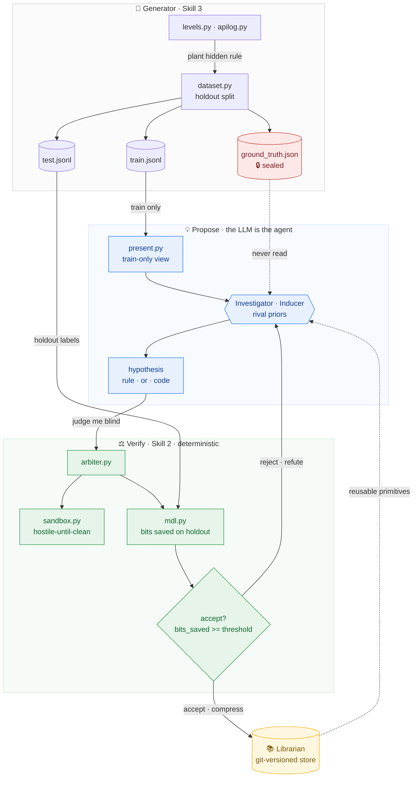
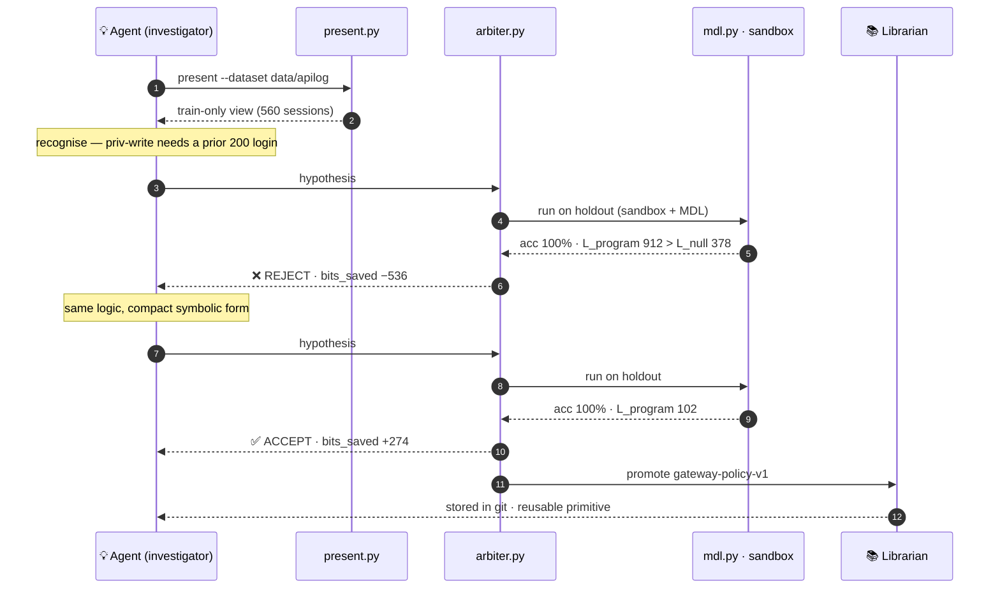

# Eureka — Rule-Induction Agent

A system that reads sequences of events and recovers the **explicit, executable,
auditable rules** that generated them. See
[`rule_induction_agent_plan.md`](rule_induction_agent_plan.md) for the full design.

> Honesty anchor: the LLM **proposes**; deterministic code **verifies**. Rules
> are rewarded for **compression (MDL) on holdout**, not accuracy on seen data.

## How the skills work together

Three roles, one rule between them: **the agent proposes, the deterministic code
disposes.** The generator plants a hidden rule and seals the answer; the agent
sees only the *train* view and proposes a hypothesis; the arbiter judges it blind
on the *holdout* and, if it compresses, the librarian stores it as a reusable
primitive. No single piece can cheat — the proposer never sees the answer, and the
verifier never invents the rule.



### Worked example — recovering an API gateway policy

The clearest demonstration of the honesty anchor, on realistic data. A synthetic
REST-API log (`rule_induction/apilog.py`) plants a hidden gateway policy —
*`block` a session that does a privileged write (`POST /admin/*`, `DELETE
/users/*`) with no prior successful login; `throttle` if ≥6 requests or ≥2 status
429; else `allow`*. The agent recovers it from the train view alone:



The punchline is step 7 vs 12: **both hypotheses score 100% accuracy**, yet the
verbose code is rejected for being longer than the data it explains, while the
compact, legible rule is accepted and stored. Accuracy is not enough —
compression is. Reproduce it:

```bash
python -m rule_induction.apilog --out data/apilog --n 800 --seed 0   # plant the policy
python -m rule_induction.present --dataset data/apilog               # the agent's train-only view
# then, in a Claude session:  /investigator --dataset data/apilog
```

## Why compression is the honesty test

Every verdict reduces to one number: **`bits_saved`**. A *bit* is one yes/no
question — the currency of **description length**, i.e. how many questions you'd
have to answer to pin down the data exactly. The fewer bits a rule needs to write
the outcomes down, the more real structure it has captured. So Eureka judges a
hypothesis by a single question: **does it let us describe the outcomes in fewer
bits than just listing them?**

Three quantities, all measured on the **holdout** (data the proposer never saw):

| Term | Plain meaning | Gateway example |
|------|---------------|-----------------|
| **`L_null`** | bits to write the outcomes with **no rule** — code each label under its base rate | 378 |
| **`L_program`** | bits to write **the rule itself** (its description length) | code: 912 · rule: 102 |
| **`L_data\|H`** | bits to patch the rule's **mistakes** on the holdout (0 if it predicts perfectly) | ≈ 2 |

The score is simply what the rule *saves* over writing the data raw:

```
bits_saved  =  L_null  −  L_program  −  L_data|H
```

The same gateway policy, written two ways — **both 100% accurate on the holdout**:

```
verbose code :  378 − 912 − 2  =  −536   ❌ rejected   (the rule costs more than the data it explains!)
compact rule :  378 − 102 − 2  =  +274   ✅ accepted   (explains the outcomes in a quarter of the bits)
```

That contrast is the whole point. **Accuracy is blind to it** — both score 100%.
Compression is what separates *understanding* from *memorising*.

### What counting bits buys you

Charging a program for its own length, judged on data it never saw, closes the
three ways a "rule" can lie:

- **Memorisation.** A lookup table that hard-codes every case is perfectly
  accurate but huge — `L_program` explodes and `bits_saved` goes negative. It
  cannot pay for itself, so it loses to the shorter rule.
- **Luck / overfitting.** A rule tuned to quirks of the train set stumbles on the
  holdout — `L_data|H` rises and eats the savings. The verifier scores on data the
  proposer never touched, so train-side fitting buys nothing.
- **Hallucination (no rule at all).** When the data is pure noise (the `neg`
  control), *no* compressing description exists: any rule still costs `L_program`
  bits to buy nothing, so `bits_saved ≤ 0` and the honest verdict is "no rule" —
  which is why the negative control yields zero false positives.

In one line: **compression is Occam's razor made quantitative.** The shortest
description that still predicts the *unseen* data is the one most likely to be the
real rule — so "did it compress?" is a far harder and more honest test than "did
it get the right answer?".

## What's built so far

Following the plan's build order (Section 8), the two foundations are in place:

| Component | Plan role | Status | Where |
|-----------|-----------|--------|-------|
| **Synthetic data generator** | Skill 3 — the test bench | ✅ built | `.claude/skills/synthetic-data-generator/`, `rule_induction/{levels,rules,dataset,generate}.py` |
| **The Librarian** | persistent store (NOT a skill) | ✅ built | `rule_induction/librarian.py`, [`docs/librarian.md`](docs/librarian.md), `library/` |
| **Arbiter** | Skill 2 — MDL scorer + sandbox + holdout | ✅ built | `.claude/skills/arbiter/`, `rule_induction/{mdl,sandbox,arbiter,metrics}.py` |
| **Inducer** | Skill 1 — orchestrator (Mechanisms 1–3) | ✅ built | `.claude/skills/inducer/`, `rule_induction/inducer.py` |
| **Investigator (multi-agent)** | rival investigators + analogy (Mech. 4) — *the LLM is the agent* | ✅ built | `.claude/skills/investigator/`, `rule_induction/present.py` |

### Validated result profile

**Deterministic inducer** — `python -m rule_induction.evaluate` (5 seeds, n=600),
the distribution across seeds, not the best case:

```
level     recovery  halluc.  found    test_acc    bits_saved
level0      100%       —     100%    100.0%±0       155.5±2
level1      100%       —     100%    100.0%±0        79.7±3
level2      100%       —     100%    100.0%±0        78.3±6
level3      100%       —     100%    100.0%±0       155.2±8
level4        0%       —     100%     77.9%±2       106.9±7   ← partial alone
level5        0%       —     100%     63.1%±8        20.6±4   ← fails alone
neg           —         0%     0%       —             —       ← no false positives
```

Levels 0–3 solid; alone the symbolic search is partial on 4 and fails 5 — the
honest SOTA limit. The **investigator layer** (the Claude agent proposing through
the `investigator` skill, verified by the same deterministic arbiter on the
holdout) reaches exactly those two:

| Level | Mechanism | Investigator result |
|-------|-----------|---------------------|
| **level5** | analogy (Mech. 4) — recognize *counter mod k* in two vocabularies | **recovered**, 100% holdout, +390 bits |
| **level4** | hierarchy — 3 rival priors (simplicity/coverage/structure) converge, then surprise-directed refinement | **recovered** (equivalent), 100% holdout, +298 bits |

The honesty anchor holds throughout: the investigator sees **train only**; a
verbose code hypothesis that scored 100% accuracy was still **rejected** by MDL
for being longer than the data it explains, forcing the compact symbolic form.

Python, standard library only — nothing to install.

## Quickstart

```bash
# 1. Generate the difficulty ladder (levels 0–5 + negative control)
python -m rule_induction.generate --out data

# 2. Judge a hypothesis on a level's holdout (MDL + sandbox); --promote to store it
python -m rule_induction.arbiter --data data --level level1 --seed 0 \
    --hypothesis hyp.json --promote

# 3. Or let the inducer discover the rule for you (propose -> arbiter disposes)
python -m rule_induction.inducer --data data --level level1 --seed 0

# 4. Benchmark the whole loop across levels x seeds (the Section 7 metrics)
python -m rule_induction.evaluate --seeds 5 -n 600

# 5. Inspect the persistent abstraction library (initializes the git store)
python -m rule_induction.librarian list

# 6. Run the tests
python -m unittest discover -s tests -v
```

## The pieces

- **Generator (Skill 3).** Produces a *ladder* of generators, each isolating one
  capability, with the planted ground-truth rule recorded **separately** from the
  traces (so it never leaks to the inducer) and a mandatory train/test holdout.
  Read [`.claude/skills/synthetic-data-generator/SKILL.md`](.claude/skills/synthetic-data-generator/SKILL.md).
- **Librarian (persistence).** A git-versioned store of accepted abstractions,
  written by the arbiter on promotion and read by the inducer to recombine
  primitives. A **stricter threshold** gates permanent admission than per-run
  acceptance. Read [`docs/librarian.md`](docs/librarian.md).
- **Arbiter (Skill 2).** The honesty anchor: train/test holdout, sandboxed
  execution of code-hypotheses, and MDL compression scored on the holdout
  (program length included), so memorizers lose and rule-free data compresses to
  nothing. Read [`.claude/skills/arbiter/SKILL.md`](.claude/skills/arbiter/SKILL.md).
- **Inducer (Skill 1).** The orchestrator: mines a predicate pool, generates
  candidate rules (simplicity-ordered, residual-directed, recombining library
  primitives), and hands them to the arbiter — which validates on the holdout, so
  the inducer's train-side fitting can't overfit its way to acceptance. Returns a
  legible decision-list rule. Read
  [`.claude/skills/inducer/SKILL.md`](.claude/skills/inducer/SKILL.md).
- **Investigator (multi-agent, Section 5).** "LLM proposes / code verifies" made
  literal: **the Claude agent is the proposer**, running the skill — no API call,
  no model inside a Python process. Rival investigators with divergent priors
  (run inline or as parallel subagents) propose hypotheses from a **train-only**
  view; the same deterministic arbiter judges them on the holdout. This is what
  reaches analogy (level 5) and hierarchies (level 4). Read
  [`.claude/skills/investigator/SKILL.md`](.claude/skills/investigator/SKILL.md).

## Where you'd point this — use cases

Anywhere you have **sequences of events labelled with a discrete outcome** and you
need to know *the rule behind them* — not a black-box score, but an explicit,
executable, auditable rule. Bring your own data as a `--dataset` (a folder with
`train.jsonl` + `test.jsonl` in the [event format](#layout), the gateway example
is the template) and let the agent recover it.

| Domain | Events (the trace) | Outcome (the label) | What the recovered rule gives you |
|--------|--------------------|---------------------|-----------------------------------|
| **Log & incident forensics** | a request/session trace | `ok` / `error` / `timeout` | the precondition that actually triggers failures, as a rule you can put in CI |
| **Access-control audit** | who-did-what audit events | `allow` / `deny` | the *effective* authorization policy — often divergent from the documented one |
| **Spec inference / regression oracle** | observed input→output of a legacy component | the produced result | an executable oracle: when a refactor changes behaviour, compression breaks and you're alerted |
| **Fraud / abuse detection** | transaction or session stream | `flagged` / `clean` | a discriminating rule you can *show a regulator* — explainable by construction |
| **Funnel / churn analysis** | user-journey events | `converted` / `churned` | the behavioural pattern to act on — and an honest "no rule" when the data is just noise |
| **SIEM / alert mining** | security event sequences | `benign` / `malicious` | distilled detection rules from labelled incidents, ranked by how much they compress |
| **API-usage / protocol checks** | sequence of API calls | `success` / `failure` | ordering preconditions ("call B requires a prior successful A") |
| **Data-quality / ETL** | record/field event stream | `valid` / `rejected` | the validation rules the pipeline is *actually* enforcing |

Three properties make it different from a generic classifier:

- **Explainable & executable by construction.** The output is a legible rule, not
  weights — you can read it, version it, and run it as code.
- **Honest about "no rule".** Because a hypothesis must *compress* the holdout, the
  system reports nothing on noise instead of inventing a plausible story (the `neg`
  control: zero false positives). Safe to ask *"is there even a pattern here?"*.
- **It accumulates.** Every accepted rule enters the git-versioned library as a
  reusable primitive, so the system gets better at *your* domain over time.

**Good fit:** discrete event sequences + a categorical outcome + a need for an
auditable rule. **Poor fit:** continuous regression, perception (vision/audio), or
cases where a black-box predictor's accuracy is all you need and *why* doesn't matter.

## Scaling to real logs (large files, Elasticsearch / OpenSearch)

Two different problems — **size** and **source** — and the architecture already
answers the first.

**You never need the whole log.** The method is *statistical*, not exhaustive: a
rule is validated by compression on a **holdout sample**, and the statistical power
comes from a few thousand cases, not millions. If a rule is real, you recover it
(with the same high `bits_saved`) from a 5k–20k sample as from 50M events. More
data only tightens the confidence interval; it doesn't change the rule. So a giant
log is handled by **sampling**, not by loading the universe.

Handling **size**, from least to most effort:

- **Stratified sampling** (the default): take *N* cases while preserving rare
  outcomes (a 2%-rate `block` class is wiped out by uniform sampling), then write a
  bounded `train.jsonl` / `test.jsonl`.
- **Summaries over dumps:** to propose, the agent doesn't print millions of traces
  — `present.summarize` already yields the type histogram, attribute cardinalities,
  and outcome distribution; show *K* example traces plus those aggregates.
- **Streaming arbiter** (an extension): MDL is a *sum over cases* and prediction is
  *per case*, so the holdout can be scored in a single pass without holding it all
  in memory — for when you really want to validate on the full corpus.

Handling **source** — Elasticsearch / OpenSearch (or any store): write an
**ingestion adapter** (an *extractor*) that emits the same `--dataset` format
(`apilog.py` shows the target shape — it just *generates* instead of *extracts*):

1. **Stream, don't dump.** Page with **PIT + `search_after`** (or `scroll`), sorted
   by `(correlation_id, @timestamp)` — never a huge `from`/`size`.
2. **Group into cases** by a **correlation key** — `trace.id`, `session.id`, or
   `client_ip` + a time window. Discover unique keys with a **composite aggregation**.
3. **Map document → event:** with ECS fields it's direct —
   `http.request.method` + `url.path` → the event type token;
   `http.response.status_code`, latency, etc. → `attrs`.
4. **Label the outcome per case** from an existing field (`event.outcome`,
   `action`, `decision`) or derive it.
5. **Field hygiene (critical):** drop high-cardinality fields (IDs, exact
   timestamps) at ingestion — they bloat the view and tempt overfitting.
6. **Stratified-sample** and write `train.jsonl` / `test.jsonl` with the holdout split.

Bonus: push part of the *view* server-side as ES/OpenSearch **aggregations** (terms
over event types, cardinalities) so you don't even pull the data to summarise it.

## Layout

```
rule_induction/          # core library (stdlib only)
  model.py               # event / case-file data model
  rules.py               # planted labelers — the ground-truth registry
  levels.py              # the difficulty ladder (level0..level5 + neg)
  dataset.py             # holdout split + on-disk layout
  generate.py            # generator CLI  (python -m rule_induction.generate)
  apilog.py              # realistic REST-API log generator -> a --dataset (gateway policy)
  mdl.py                 # MDL scorer (prequential plug-in code, holdout)
  sandbox.py             # hostile-until-clean runner for code-hypotheses
  arbiter.py             # the arbiter + CLI (python -m rule_induction.arbiter)
  inducer.py             # the inducer + CLI (python -m rule_induction.inducer)
  metrics.py             # ground-truth checks (rule recovery, hallucination)
  evaluate.py            # benchmark harness + CLI (python -m rule_induction.evaluate)
  present.py             # investigator's train-only view + residuals (the agent reads this)
  librarian.py           # the persistent store + CLI (python -m rule_induction.librarian)
.claude/skills/
  synthetic-data-generator/SKILL.md
  arbiter/SKILL.md
  inducer/SKILL.md
  investigator/SKILL.md  # multi-agent: the Claude agent proposes; the arbiter verifies
docs/librarian.md
tests/                   # unittest: generator exactness + librarian thresholds
data/                    # generated datasets (gitignored)
library/                 # the abstraction store (its own git repo)
```
