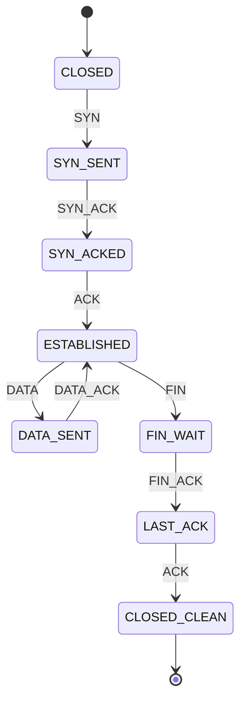

## ⚠️ First: the dataset

`data/tu_protocolo` doesn't exist — that's the skill's template placeholder ("*your* protocol"). The datasets present are the supervised classification ladder (`level0–5`, `neg`) and one protocol-shaped set, **`apilog`** (API-gateway sessions). I ran the inference on `apilog` and, where it fits, on the built-in handshake demo.

## `apilog`: the honest finding — no compact automaton generated these traces

The whole point of this skill's MDL check is to keep a state machine **only if it compresses**. On `apilog` it never does:

| Symbol mapping | k | DFA states | bits saved |
|---|---|---|---|
| raw message type | 1 | 20 | **−2457** |
| raw message type | 2 | 211 | **−5502** |
| type + `status` | 2 | 265 | **−9944** |
| role abstraction¹ | 1 | 3 (all self-loops) | **−3387** |
| role abstraction¹ | 3 | 48 | **−1618** |

¹ collapsed to `READ / LOGIN_OK / LOGIN_FAIL / WRITE / THROTTLE` — my job per the skill (choose the alphabet).

Every variant loses to the structureless baseline, and the cleanest abstraction collapses to **3 states that are nothing but self-loops** ("any request, any time"). That is the signal that **`apilog` is not produced by a finite-state protocol.** There's no handshake and no ordered phases — sessions are free-form request streams. Its labels (`allow`/`throttle`/`block`) come from a *counting + flag policy*:

> block = a privileged write (`POST_admin`/`DELETE_user`) with **no prior** `POST_login:200`; throttle = ≥6 requests **or** ≥2 `status:429`; else allow.

That's a **counter automaton / predicate policy**, not a message grammar — recoverable by Eureka's supervised **`inducer`/`arbiter`** (which has the `outcome` label to fit against), not by this unsupervised state-merger. Drawing a tidy diagram here would be fabricating structure the data doesn't have.

## What the deliverable looks like when the data *is* a protocol

To show the skill working end-to-end, here's the built-in handshake set — **8 states, +9,262 bits saved** (32→8-state prefix tree), with the engine's `S0..S7` renamed to protocol semantics:

| Engine | Semantic name | Meaning | Leaves on |
|---|---|---|---|
| S0 | `CLOSED` | start, no connection | `SYN` |
| S1 | `SYN_SENT` | opener sent `SYN` | `SYN_ACK` |
| S2 | `SYN_ACKED` | peer acknowledged | `ACK` |
| S3 | `ESTABLISHED` | **loop hub** — data or teardown | `DATA`, `FIN` |
| S4 | `DATA_SENT` | awaiting ack for a data segment | `DATA_ACK` → back to `ESTABLISHED` |
| S5 | `FIN_WAIT` | teardown begun | `FIN_ACK` |
| S6 | `LAST_ACK` | final ack pending | `ACK` |
| S7 | `CLOSED_CLEAN` ✅ | clean end (accepting) | — |

- **Compression:** 1,060 bits vs 10,368 baseline → **+9,262 saved** — the structure pays for itself.
- **Generalisation:** the `ESTABLISHED ⇄ DATA_SENT` cycle means it accepts traces with **more `DATA` rounds than ever seen** — repetition folded into a loop, exactly what k-tails buys.

## Recommendation

- For a **real protocol capture** (TCP/TLS/SIP/HTTP handshakes, ordered API call sequences), point the skill at it: `python -m rule_induction.protocol --dataset <dir> --k 2` — one session per case, drop high-cardinality fields. I'll name the states.
- For **`apilog`'s** allow/throttle/block decision, use the **`inducer`** skill — it'll recover the privileged-write-before-login + request/429-count policy as an explicit, holdout-validated rule.
